# TUFLOW Summary Dashboard Tool

## Introduction

The **TUFLOW Summary Dashboard** tool provides a dashboard interface that allows users to drag and drop a **TUFLOW Summary File (TSF)** or a **TUFLOW *.hpc.dt.csv** file. It then plots a number of summary statistics and visualisations summarising the **TUFLOW HPC timesteps** and **control numbers**.

This tool offers a quick way to visualise the success and quality of a TUFLOW simulation and allows users to download the information for **QA purposes**.

---

## Run Locally or Host on the Cloud

The tool can be run in two ways:

### 1. **Locally**
- Run as a Python script from your IDE.
- Requires the following Python libraries:
  - `Plotly`
  - `Plotly Dash`
  - `Pandas`
  - `Numpy`
- Once running, navigate to [http://127.0.0.1:8050/](http://127.0.0.1:8050/) in your browser to access the dashboard.

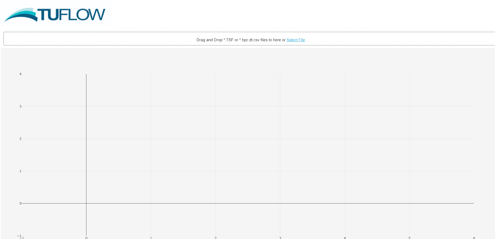

### 2. **Cloud Hosting**
- Hosted version available via a cloud link.
- Example: [TUFLOW Summary Dashboard on render](https://tuflow-dashboard.onrender.com/)
- Note:
  - Free cloud hosting may be slower.
  - Limited memory.
  - Single-user access only.

---

## File Uploads

### **TUFLOW Summary File (TSF)**
- Drag and drop a TSF file to generate a reporting dashboard.
- Dashboard appearance varies based on:
  - TUFLOW Classic vs HPC
  - Simulation status (ongoing or completed)

#### **Completed Simulation**
- Displays:
  - Hardware and solver used
  - Model nature and size
  - Warnings and messages
  - Runtime information
  - Inflows/outflows summary
  - Mass balance summary
  
   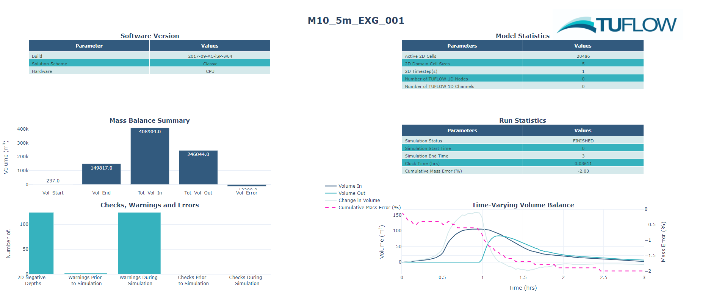

#### **Simulation in Progress**
- Displays:
  - All of the above
  - Simulation progress
  - Estimated remaining time
  
  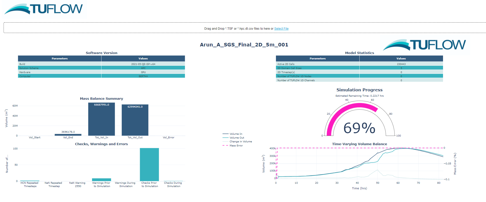

---

### **HPC.DT.CSV Files**
- Upload a `*.hpc.dt.csv` file to generate subplots for each column.
- Includes:
  - Timesteps
  - Target timesteps
  - Control numbers
- Subplots are linked:
  - Zooming in on one affects all others

  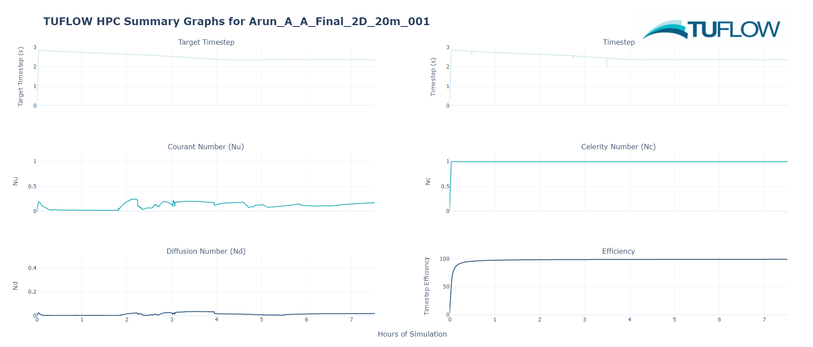
  
---

### **MB.CSV Files**
- Upload a `*_MB.csv` file to generate subplots with mass balance information.
- Includes:
  - Volumes from boundaries (H, S Estry and X1D boundaries)
  - Total and Cumulative Volumes
  - Mass Error
- Subplots are linked:
  - Zooming in on one affects all others

  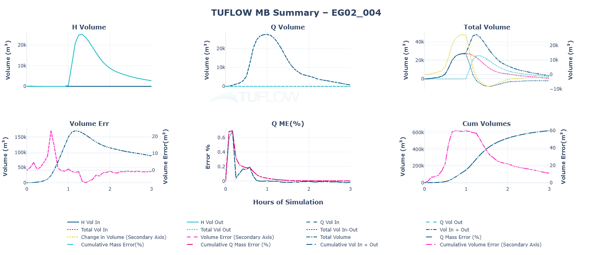

---
 
### **MB_HPC.CSV Files**
- Upload a `*_MB_HPC.csv` file to generate subplots with mass balance information.
- Includes:
  - Volumes from boundaries (H, S Estry and X1D boundaries)
  - Total and Cumulative Volumes
  - Mass Error
- Subplots are linked:
  - Zooming in on one affects all others

  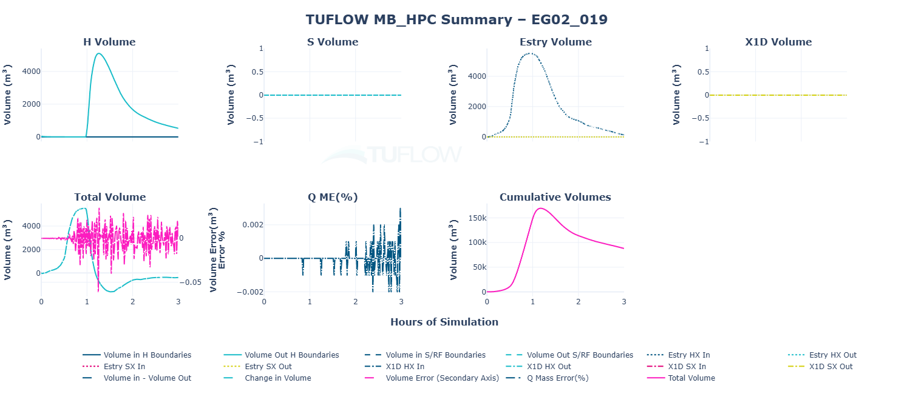 
  
---
 
### **MB2D.CSV Files**
- Upload a `*_MB2D.csv` file to generate subplots with mass balance information.
- Includes:
  - Volumes from boundaries (H, S Estry and X1D boundaries)
  - Total and Cumulative Volumes
  - Mass Error
- Subplots are linked:
  - Zooming in on one affects all others

  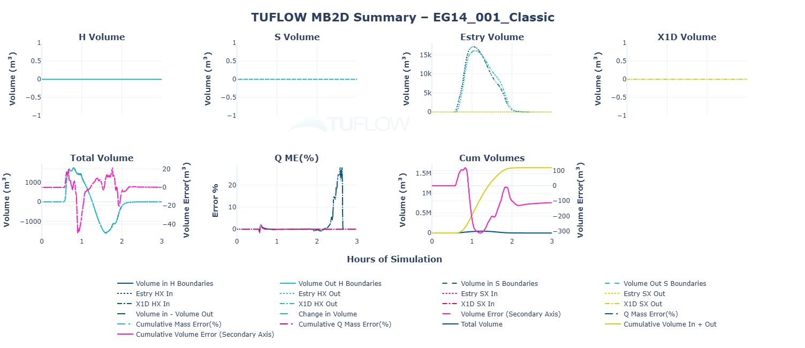
  
---
 
### **MB1D.CSV Files**
- Upload a `*_MB1D.csv` file to generate subplots with mass balance information.
- Includes:
  - Volumes from boundaries (H, S Estry and X1D boundaries)
  - Total and Cumulative Volumes
  - Mass Error
- Subplots are linked:
  - Zooming in on one affects all others

  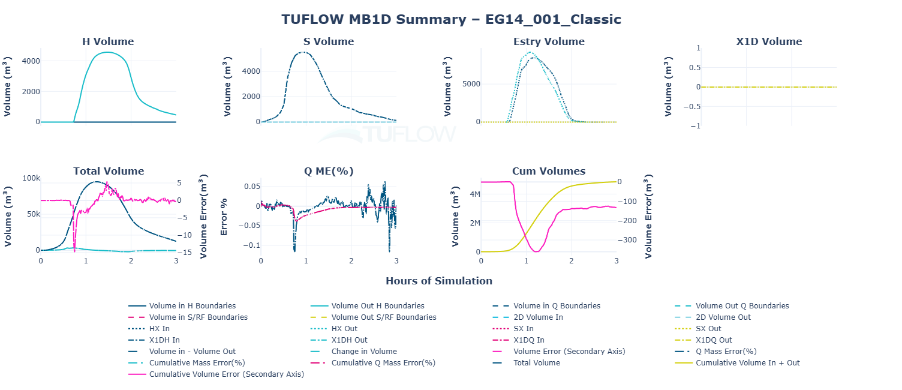
  
---
 
### **_1D_MB.CSV Files**
- Upload a `*_1D_MB.csv` file to generate 1D node mass balance plots.
	- Dropdown menu can be used to select different nodes and plots mass balance.

  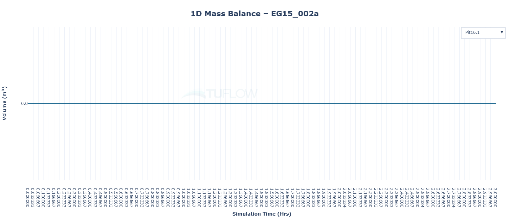
  
---
 
### **_PO.CSV Files**
- Upload a `*_PO.csv` file to generate time series plots.
	- Dropdown menu can be used to select different Plot Output (PO) points/lines/polygons.

  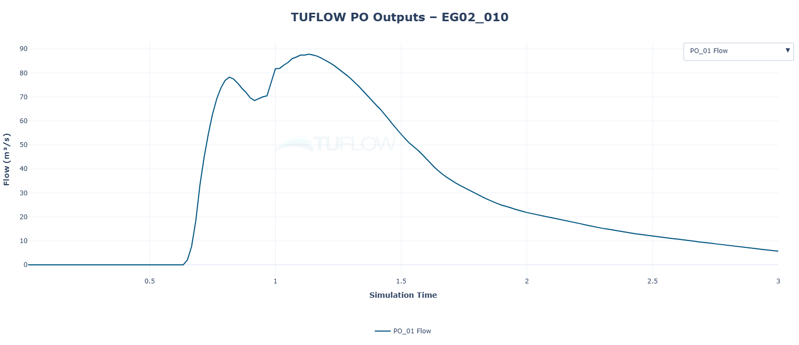
  
---
 
### **.tlf Files**
- Upload a `*.tlf` file to generate a table of the TLF settings.
	- Those settings which are not defaults are higlighted.

  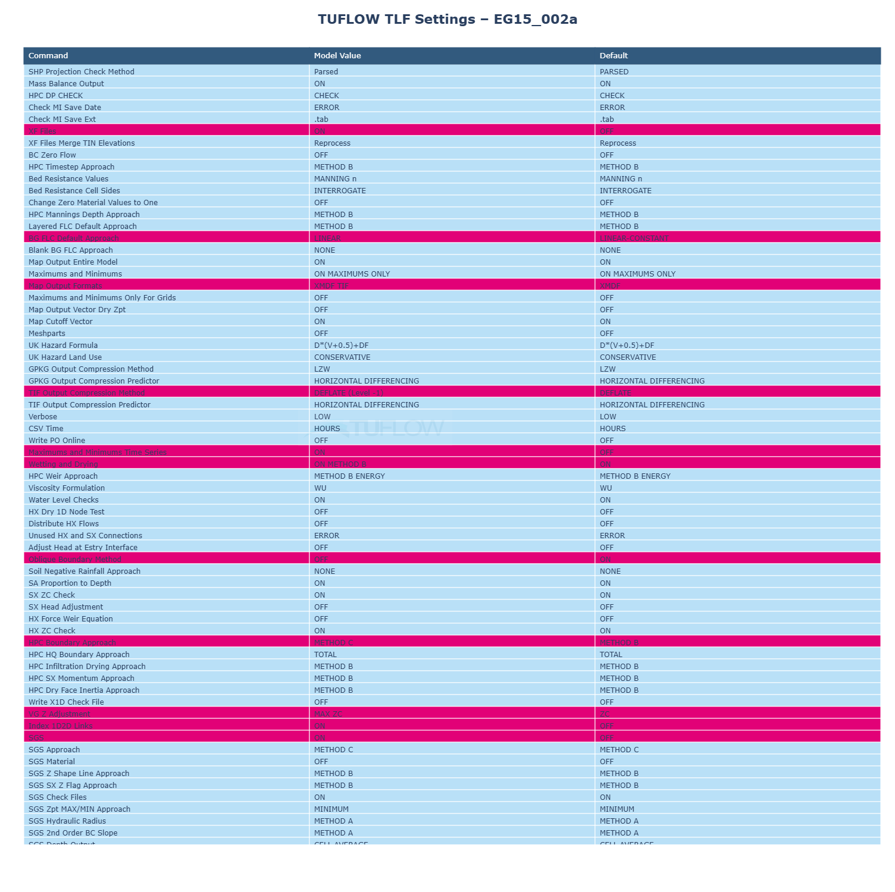
  
---
 
### **TUFLOW Simulations.log Files**
- Upload a `_ TUFLOW Simulations.log` file to generate a table summary of the success of the simulations.
	- Those settings which are not defaults are higlighted.

  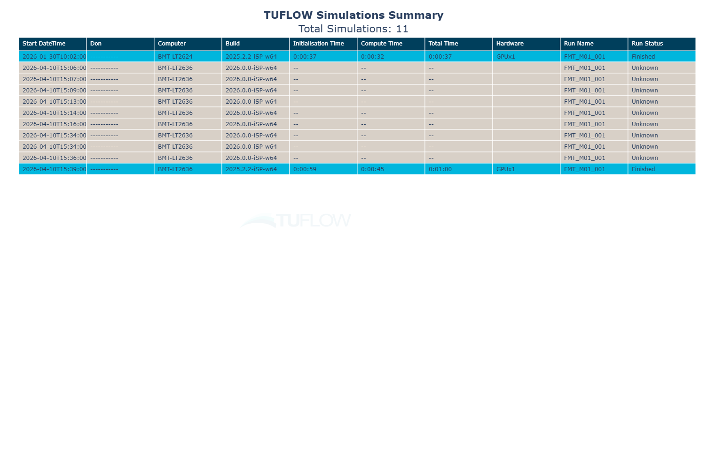
  
---

### **Messages.csv Files**
- Upload a `*_messages.csv` file to generate a table of the model messages.
	- Counts unique messages and sorts in order from highest to lowest.
	- Colour coded based on severity

  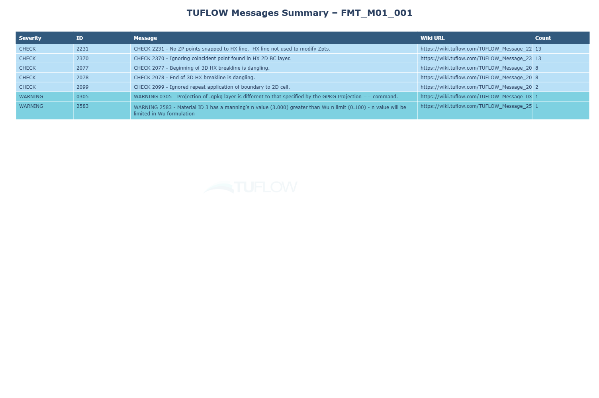
  
---

### **run_stats.txt Files**
- Upload a `*_run_stats.txt` file to generate a plot of the relative contributions of 1D, 2D and Other contributions to the run time.
	- Other includes writing of outputs, and transfer of data to GPU (if running on GPU devices). The “other” column also includes time spent within an external 1D solver.

  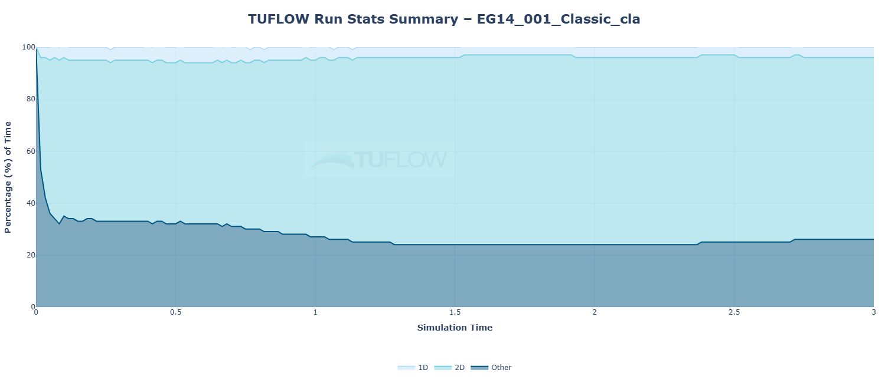
  
---

### **start_stats.txt Files**
- Upload a `*_start_stats.txt` file to generate a plots of the startup times.
	- Plot of the elapsed time of each start up stage.  Useful to identify bottlenecks in the model start up.  Stages with elapsed times less than 0.05s are accumulated into other.
	- Plot of the cumulative start up time accross the various start up stages.

  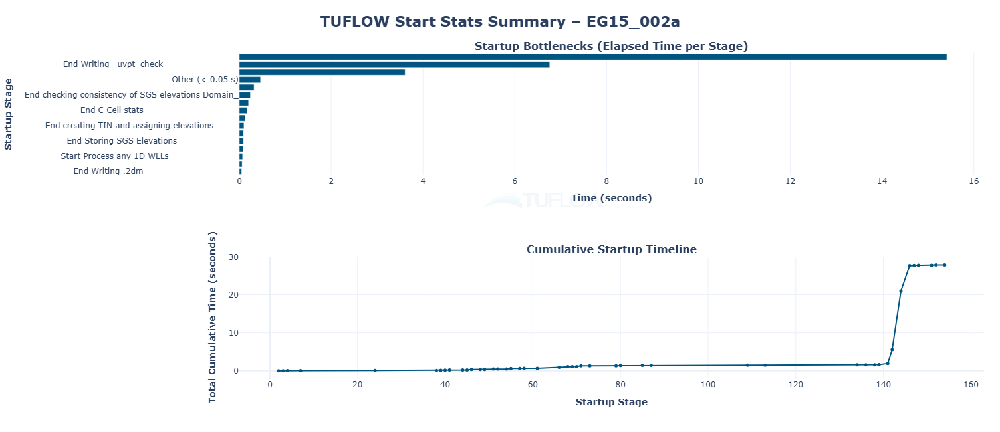
  
---

## Dashboard Menu Items

- Hover in the top-right corner of the dashboard to reveal the menu bar.
- Tools available:
  - Zoom
  - Pan to full extent
  - Reset axes
  - Toggle spike lines
  - Download plot as PNG
  - And more

  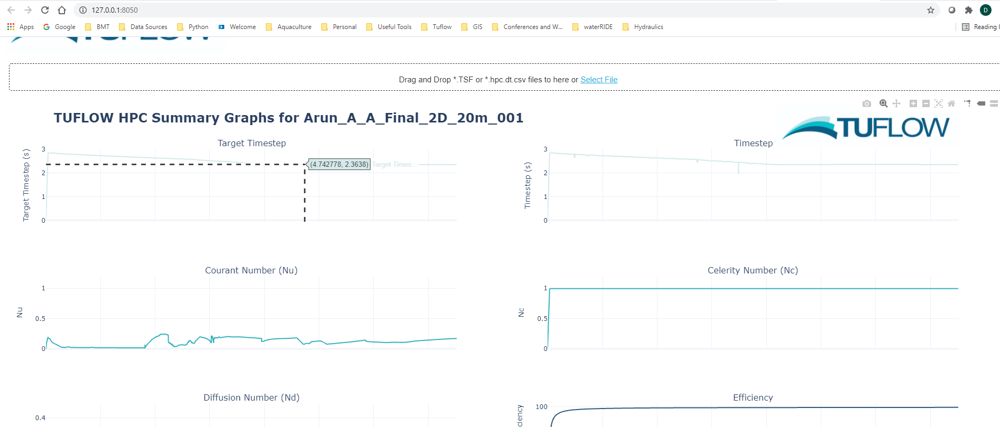
---

